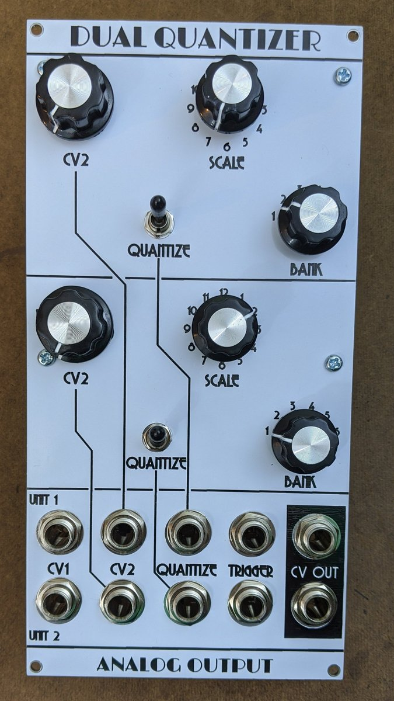

# QuantizerModule
Code and hardware for Kosmo/Eurorack quantizer module

This is a dual quantizer based on the [dac/ino](https://github.com/holmesrichards/dac_ino) board. As such it uses the dac\_ino library as well as the Quantizer library in this repository. 

Design is for Kosmo format module but the PCB and code would work equally well for a Eurorack version if the board were mounted perpendicular to the panel. It would just need a smaller front panel. Likewise with perpendicular mounting it could be a smaller single Kosmo quantizer.

## Front panel
On the front panel, for each quantizer section, are:

- CV1 and CV2 inputs
- Quantize gate input
- Trigger input
- CV output
- CV2 attenuator
- Quantize toggle switch
- Scale selection 12 position rotary switch
- Bank selection 6 position switch

## Use
The control voltage to be quantized is plugged into CV1. It should be in the range 0–5 volts, though voltages outside this range (within reason) shouldn't cause damage.

CV2 is an offset; it is added to the quantized CV1 to produce the output. It should also be in the range 0–5 volts. It can be attenuated with the knob. Normalled value is 5 volts before attenuation.

The Quantize switch can be used to disable quantization, in which case the output CV is just CV1 + CV2 (attenuated). If the Quantize switch is on and a gate source is plugged into the Quantize input, quantization is on only when the gate is on. If nothing is plugged in and the Quantize switch is on, quantization is on.

If nothing is plugged into the Trigger input, the input control voltages are sampled and the output control voltage is updated continually. If a trigger or gate source is plugged in, updating occurs only when a trigger or gate is present. In that case the module behaves like a quantizing (or not, if quantizing is off) sample and hold.

The rotary switches are used to select a bank of scales and a scale within that bank. There can be up to 12 scales stored in each of up to 6 banks, which makes 72 scales for those of you who've lost your calculator. ("Up to." Depending on the scales, 72 of them might exceed the Arduino's program memory capacity.) See [scales document](./docs/SCALES.md) for the scales built into the software as supplied. If you want other scales it's easy enough to change them. There's a mechanism to convert Scala format scale files, or definitions in terms of equal divisions of the octave or generators and periods into data for the Quantizer library. See [change scale instructions](./docs/CHANGESCALES.md).

## Current requirements
28 mA +12 V  
 4 mA -12 V

## Building
For build notes see [here](docs/BUILD.md).

## Software
A sketch and two libraries are required:

- [QuantSketch.ino](software/QuantSketch/QuantSketch.ino)
- [Quantizer library](software/Quantizer) (.cpp and .h files)
- [dac/ino library](https://github.com/holmesrichards/dac_ino/tree/master/software) (.cpp and .h files)

But the dac_ino library itself uses three libraries:

- Arduino, which is standard (built in to the IDE)
- SPI, which I think is also built in to the IDE
- DirectIO, from here: https://github.com/mmarchetti/DirectIO.git For this you apparently just need DirectIO.h, there is no .cpp file.

On my system (Linux, off-line Arduino IDE) the non standard libraries are in sub-folders, named Quantizer, dac_ino, and DirectIO, of the ~/Arduino/libraries folder. QuantSketch.ino can be anywhere though the IDE wants it to be inside a folder called QuantSketch. For details and other platforms and IDEs, consult Arduino documentation.

## Credits
The Quantizer library and the table building script are based on work by Brendon Cassidy, see https://github.com/bpcmusic/telex and https://github.com/bpcmusic/telex_scales .

