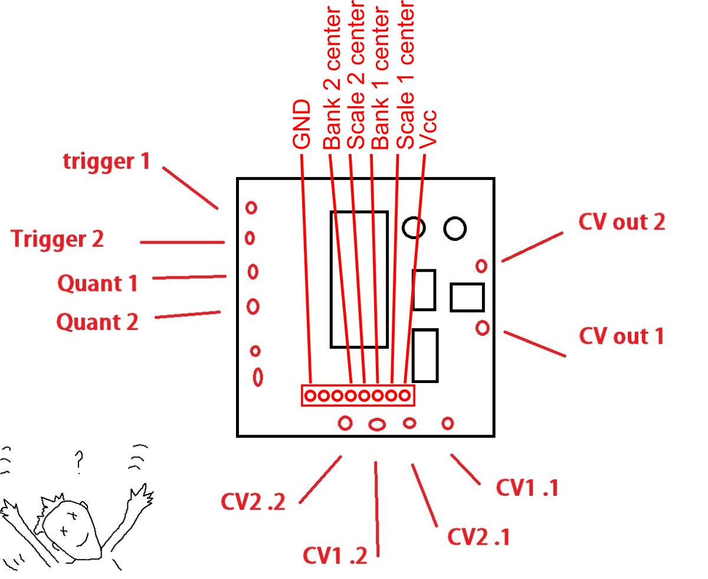
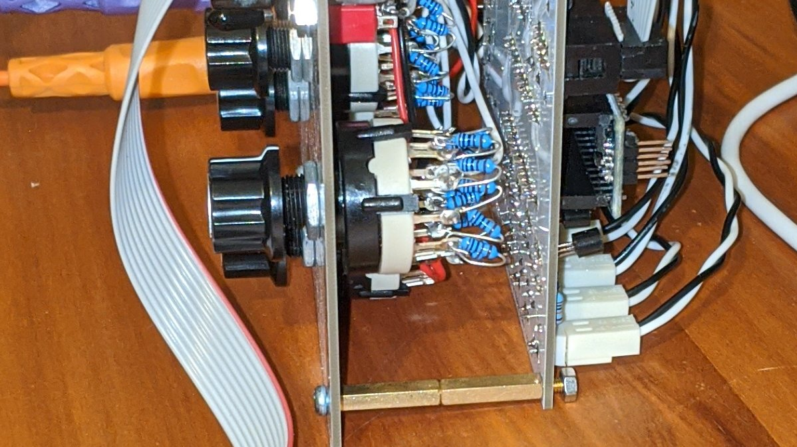
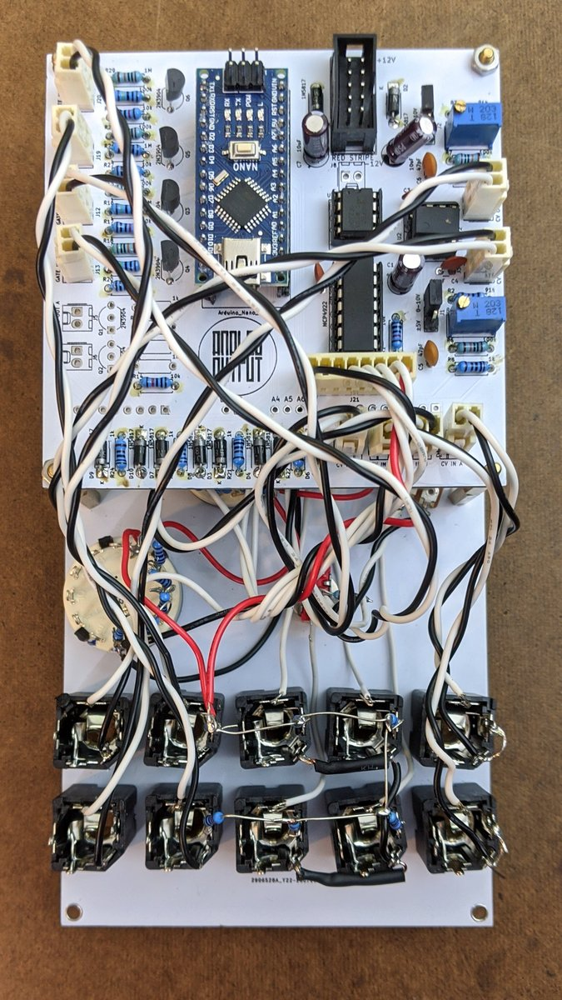

# Dual Quantizer Build Notes

## dac/ino build information
Current version uses v1.3 release of the [dac/ino](https://github.com/holmesrichards/dac_ino) board. See that repository for general building information.

**Note that the dac/ino schematic (for the board) and the Quantizer schematic (for the panel components) are two separate things. Component references below are to the dac/ino board, *not* the Quantizer panel. **

Dual Quantizer does not use:

* Gate Out A and B
* All pin headers (aside from 3-pin jumper headers)
* VCC/Gnd Molex header

so these dac/ino components can be omitted: Q1, Q2, R10–13 (don't omit R14!), J5–J8, J10, J11, J14

dac/ino CV outputs can range 0–10V or ±5V. Set jumpers for 0–10V outputs. Since CV1 is limited to 0–5V, the quantized CV1 will also be limited to about 0–5V, but the CV2 offset can change the output range up to 5–10V. If desired you can omit J1 and J2 in favor of hardwired jumpers.

Use 35 mm spacers to mount dac/ino board to the panel after wiring is done.

## Quantizer panel

Mount panel components to the panel, then wire (referring to [panel components schematic](./quantpc.pdf)):

* CV1 In tip normal pins to sleeve pins. Connect sleeve and tip pins to 2-pin Molex connectors to CV In A and C on the dac/ino board (ground is on the right side of the Molex header as viewed from the tab side).
* CV2 In tip pins to pin 3 on the attenuators. Connect sleeves to ground. 
* Quantize tip to bottom terminals of toggle switches. Connect sleeves to ground. 
* Trigger tips and sleeves to Molex connectors to Gate In A and B.
* CV Out tips to Molex connectors to CV Out A and B.
* 10k resistors to CV2, Quantize, and Trigger tip normal pins. Other ends of resistors to VCC pin on 8 pin Molex connector.
* 100k resistors to toggle middle terminals. Other end of resistor to 2-pin Molex ground side. Middle terminal to 2-pin Molex other side. 2-pin Molex to Gate In C and D. Toggle top terminals are not connected.
* Attenuator pins 1 and 2 to a 2-pin Molex connector (pin 1 is ground) to CV In B and D.
* On Scale rotary switches, add 11 1k resistors between pins 1–2, 2–3, 3–4, … 11–12. Wire center pin to 8 pin Molex as shown in circuit diagram. Connect pin 1 to ground and pin 12 to VCC from 8 pin Molex. 
* On Bank rotary switches, add 5 1k resistors between pins 1–2, 2–3, 3–4, 4–5, 5–6. Wire center pin to 8 pin Molex as shown in circuit diagram. Connect pin 1 to ground and 6 to VCC from 8 pin Molex. 

Here's a diagram (by Dud):
 

Here's a photo where you can kind of see the rotary switches:

8 pin Molex connections are, from left to right:

1 Ground
2 Not connected
3 Not connected
4 Bank 2 switch center pin
5 Scale 2 switch center pin
6 Bank 1 switch center pin
7 Scale 1 switch center pin
8 Vcc

Wiring photo: (Black wires are ground, red are Vcc, white others are signals)

BOM for the panel components is [here](quantpc_bom.md).
